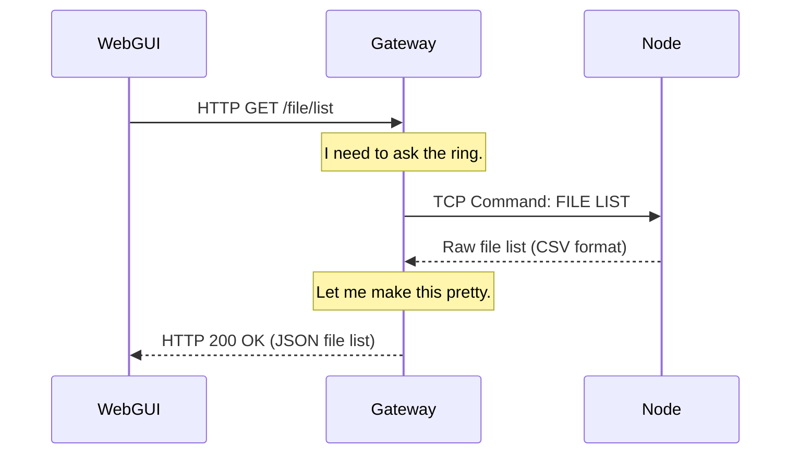

# Chapter 1: Gateway

Welcome to the OuroborosFS tutorial! We're excited to have you here. In this first chapter, we'll explore the very first
component you'll interact with: the **Gateway**.

Imagine a large, bustling office building. This building is our distributed file system. Instead of wandering around
trying to find the right person or department, you simply walk up to the front desk. The receptionist there can answer
your questions, direct your mail, and connect you to the right people.

In OuroborosFS, the **Gateway** is that friendly and essential receptionist.

## What Problem Does the Gateway Solve?

OuroborosFS is a *distributed* system, meaning it's made up of many individual computers (which we'll
call [Nodes](02_node_.md)) working together. Talking to each [Node](02_node_.md) directly would be complicated. You'd
need to know which one is online, which one has the file you want, and how to speak their special language.

The Gateway solves this by providing a single, simple entry point for the entire system.

Our main use case: **You just opened the OuroborosFS web interface in your browser. How does it know what files are
stored in the system?**

The browser doesn't talk to all the individual [Nodes](02_node_.md). It just talks to the Gateway.

## The Gateway's Two Main Jobs

The Gateway is a clever component that can handle two different types of conversations:

1. **Friendly HTTP Server:** For user-friendly applications like our web interface, the Gateway runs a standard web (
   HTTP) server. It understands web requests and provides nicely formatted data (like JSON) in return.
2. **Efficient TCP Proxy:** For scripts or advanced tools, the Gateway can act as a simple forwarder. It takes raw
   commands and passes them directly to a [Node](02_node_.md) in the system, acting like a middleman.

Let's see how the web interface uses the Gateway's HTTP server to get the list of files.

### The Web Interface Asks for Files

Our web interface is a modern web app. To get data, it makes an HTTP request to an API endpoint. Let's look at the code
that does this.

**File:** `src-gui/ouroborosfs-vue-gui/src/stores/network.ts`

```typescript
const API_BASE = 'http://127.0.0.1:8000'

/** Fetches the latest file list from the gateway */
async function fileList() {
    filesLoading.value = true
    try {
        // The browser sends a GET request to our gateway
        const response = await fetch(`${API_BASE}/file/list`)

        // ... handle the response ...
    }
    // ... handle errors ...
}
```

This is a standard way for a web frontend to ask a backend for information.

* `API_BASE` is simply the address where our Gateway is running.
* The `fetch` command sends a `GET` request to the `/file/list` path on that address.
* The web app expects the Gateway to respond with a list of files, which it can then display to the user.

Simple, right? The web app doesn't need to know anything about the complex network of [Nodes](02_node_.md) behind the
Gateway. It just makes one clean, simple request.

## Under the Hood: How the Gateway Responds

So, what happens inside the Gateway when it receives that `/file/list` request? It can't answer the question by itself,
because it doesn't store any files. It needs to ask the actual storage system, the ring of [Nodes](02_node_.md).

Here's a step-by-step walkthrough of the process:

1. **HTTP Request Arrives:** The Gateway receives the `GET /file/list` request from the web browser.
2. **Translate the Request:** The Gateway knows this means it needs to get the file index from the storage ring. It
   translates the user-friendly HTTP request into the system's internal language: a raw TCP command, `FILE LIST`.
3. **Find a Node:** The Gateway looks at its list of known [Nodes](02_node_.md) and connects to one that is currently
   alive. We'll learn more about how it knows this in the [Ring Topology & Discovery](03_ring_topology___discovery_.md)
   chapter.
4. **Send the Command:** It sends the `FILE LIST` command to the chosen [Node](02_node_.md).
5. **Receive the Response:** The [Node](02_node_.md) replies with the file data, but in a simple, raw format (like CSV).
6. **Format for the Web:** The Gateway takes this raw response and converts it into a clean JSON format that web
   browsers love.
7. **Send HTTP Response:** Finally, the Gateway sends this JSON data back to the web browser, completing the original
   request.

This translation process is the Gateway's most important job. It acts as a bridge between the human-friendly web and the
machine-efficient internal network.

### A Diagram of the Flow

Here is a simple diagram showing the participants in this conversation.



## A Glimpse into the Code

Let's peek at the Rust code that makes this happen. Don't worry if you don't know Rust, we'll focus on the logic.

### 1. Listening for Connections

First, the Gateway starts a server that listens for any incoming connection, whether it's HTTP from a browser or a raw
TCP command from a script.

**File:** `src/gateway.rs`

```rust
pub async fn run_server(self: Arc<Self>, listen_addr: String) -> io::Result<()> {
    let listener = TcpListener::bind(&listen_addr).await?;
    tracing::info!(addr = %listen_addr, "Gateway listening (HTTP + TCP)");

    loop {
        let (client_stream, _) = listener.accept().await?;
        // ... handle each new connection ...
    }
}
```

This is the main loop. It just waits for someone to connect. When they do, it hands off the connection to a handler.

### 2. Sniffing the Protocol

The handler's first job is to figure out who it's talking to. Is it a web browser speaking HTTP, or a script speaking
our raw TCP protocol? It does this by "sniffing" the first line of the message.

**File:** `src/gateway.rs`

```rust
async fn handle_connection(/* ... */) {
    // ... read the first line from the client ...
    let mut first_line = String::new();
    buf_reader.read_line(&mut first_line).await?;

    // Check if it looks like an HTTP request
    if first_line.starts_with("GET /") || first_line.starts_with("POST /") {
        // Handle HTTP request
        self.handle_http_request(/* ... */).await?;
    } else {
        // Handle raw TCP
        self.handle_tcp_proxy(/* ... */).await?;
    }
}
```

If the message starts with `GET /` or `POST /`, the Gateway knows it's talking to a web client. Otherwise, it assumes
it's a raw TCP command and just proxies it.

### 3. Handling the HTTP Request

When our web GUI asks for `/file/list`, the HTTP handler matches the path and calls the right function.

**File:** `src/gateway.rs`

```rust
async fn handle_http_request(/* ... */) {
    // ... figure out the method and path ...

    match (method, path) {
        // ... other paths ...
        ("GET", "/file/list") => match self.fetch_file_list().await {
            Ok(list) => Self::send_json_response(writer, &list).await,
            Err(e) => Self::send_error_response(writer, 500, &e.to_string()).await,
        },
        // ... other paths ...
    }
}
```

This code directs the request to `fetch_file_list`, which does the actual work of talking to the [Node](02_node_.md).

### 4. Fetching Data from the Ring

This is where the Gateway switches hats from an HTTP server to a TCP client. It connects to a [Node](02_node_.md), sends
the raw command, and parses the response.

**File:** `src/gateway.rs`

```rust
async fn fetch_file_list(&self) -> Result<Vec<FileInfo>, /*...*/> {
    // 1. Connect to any available node in the ring
    let mut stream = self.connect_to_ring().await?;

    // 2. Send the raw TCP command
    stream.write_all(b"FILE LIST\n").await?;

    // 3. Read the response and parse it into a nice list
    // ... parsing logic ...

    Ok(files)
}
```

This function perfectly shows the Gateway's role as a translator. It receives an HTTP request and, in turn, sends a TCP
command to get the answer.

## Conclusion

You've just learned about the OuroborosFS **Gateway**, the system's public-facing receptionist.

* It provides a **single, stable entry point** to the entire distributed network.
* It acts as a **translator**, converting friendly web (HTTP) requests into the system's efficient internal (TCP)
  language.
* It simplifies development for clients like the web GUI, which don't need to know about the complex ring
  of [Nodes](02_node_.md) working in the background.

Now that we understand the "receptionist," let's go behind the front desk and meet the "employees" it manages.

In the next chapter, we'll explore what a **[Node](02_node_.md)** is, what it does, and how it forms the backbone of our
distributed file system.

➡️ **Next Chapter: [Node](02_node_.md)**

---

Generated by [AI Codebase Knowledge Builder](https://github.com/The-Pocket/Tutorial-Codebase-Knowledge)