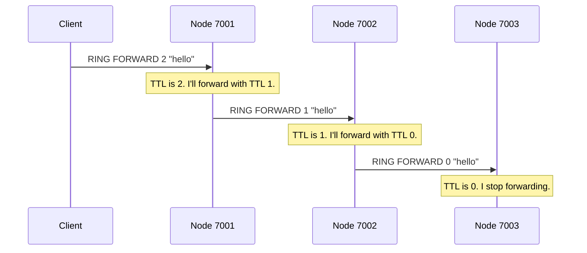

# Chapter 2: Node

In the [previous chapter](01_gateway_.md), we met the OuroborosFS **Gateway**, the friendly receptionist for our entire distributed file system. It takes simple requests from the outside world and translates them for the internal network.

But who does the Gateway talk to? Who are the "employees" behind the front desk doing all the actual work?

Welcome to the world of the **Node**.

## What is a Node?

If the Gateway is the receptionist, a **Node** is a single, hard-working employee. It's the fundamental building block of the OuroborosFS network.

Think of it as a single computer in a peer-to-peer network. Each time you run the OuroborosFS application, you are starting one Node.

A Node has three simple but vital jobs:
1.  **Listen for Commands:** It runs a server that waits for instructions, like `FILE LIST` from the Gateway or a message from another Node.
2.  **Store Data:** It is responsible for holding a piece of the total data in the system. Each Node has its own small storage directory.
3.  **Know its Neighbor:** A Node doesn't need to know about every other Node in the system. It only needs to know the address of the *very next Node* in the circle.

Together, a collection of these Nodes forms a logical ring, like friends sitting in a circle, passing notes to one another.

### Our Use Case: Storing and Finding Files

Let's revisit our use case from the last chapter: **The Gateway needs to get a list of all files in the system.**

The Gateway asks a single Node for this list. How does that one Node know about files that might be stored on other Nodes across the network? To answer this, we need to look at the Node's "brain"—its internal state.

## The Anatomy of a Node

The core of every Node is a data structure that holds all its important information. Let's look at a simplified version of this structure.

**File:** `src/node.rs`
```rust
pub struct Node {
    /// Where this node is listening (e.g., "127.0.0.1:7001")
    pub port: String,

    /// Address of the next node in the ring
    pub next_port: RwLock<Option<String>>,

    /// A map of every file in the system to its location
    pub file_tags: RwLock<HashMap<String, FileTag>>,

    // ... other state for managing the network ...
}
```

This is a very simple blueprint:
*   `port`: This is the Node's own address. It's how others can find and talk to it.
*   `next_port`: This is the most crucial part for forming the ring. It holds the address of the next Node in the circle. If this isn't set, the Node is isolated.
*   `file_tags`: This is the Node's "card catalog" or index. It keeps track of *every file* in the system, not just its own. It knows which Node started storing a file and how many pieces it was split into.

You might be wondering how `file_tags` on one Node gets filled with information about files on other Nodes. This happens through a process of communication and synchronization, which we'll cover in detail in the [Ring Topology & Discovery](03_ring_topology___discovery_.md) chapter. For now, just know that Nodes are constantly talking to each other to keep this index up-to-date.

## A Node in Action

Every running Node starts a server that listens for incoming TCP connections. This is the Node's "ear," waiting for commands.

**File:** `src/server.rs`
```rust
pub async fn run(bind_addr: &str, /*...*/) -> Result<(), AnyErr> {
    // ... setup code to start listening on an address ...
    let listener = /* ... */;
    
    // Initialize this node's state
    let node = Node::new(/* ... */);
    tracing::info!(node = %node.port, "Node listening");

    loop {
        // Wait for a connection from a client or another node
        let (stream, peer) = listener.accept().await?;
        
        // Handle the connection
        tokio::spawn(async move {
            handle_client(node, stream).await;
        });
    }
}
```
This is the main loop for any Node. It waits for someone to connect (like our Gateway) and then passes the connection to `handle_client` to figure out what they want.

### Fulfilling the `FILE LIST` Request

When the Gateway sends a `FILE LIST` command, the `handle_client` function directs it to a specific handler. This handler's job is to read from the `file_tags` map and send back a nicely formatted list.

**File:** `src/server.rs`
```rust
async fn handle_file_list_csv<W: AsyncWrite + Unpin>(
    node: &Node,
    writer: &mut W,
) -> Result<(), AnyErr> {
    // Read from the Node's "file_tags" map
    let tags = node.file_tags.read().await;

    // ... code to sort and format the file list as CSV ...
    for (name, tag) in items {
        writer.write_all(
            format!("{},{},{}\n", name, tag.start, tag.size).as_bytes()
        ).await?;
    }

    Ok(())
}
```
This is how a single Node can answer the Gateway's question. It consults its internal index (`file_tags`) and provides a complete list of all files across the entire system.

## Passing Messages: Life in the Ring

The real power of OuroborosFS comes from Nodes working together. A Node's ability to talk to its `next_port` is what makes the distributed system possible.

Let's see how a simple message can be passed around the ring. We have a command called `RING FORWARD` that does exactly this. Its purpose is to forward a message a certain number of times (called a "Time To Live" or TTL).

Here's how it works:



This simple mechanism is the foundation for almost all complex operations in OuroborosFS, from discovering all the nodes in the network to distributing file chunks.

### A Look at the Code

Let's see the code that makes this message-passing happen. First, the handler that receives the command:

**File:** `src/server.rs`
```rust
async fn handle_ring_forward<W: AsyncWrite + Unpin>(
    node: &Node,
    writer: &mut W,
    mut ttl: u32,
    msg: String,
) -> Result<(), AnyErr> {
    // If the Time-To-Live is greater than 0...
    if ttl > 0 {
        ttl -= 1;
        // ...ask the node to forward the message to its neighbor.
        node.forward_ring_forward(ttl, &msg).await?;
    }
    
    // Respond "OK" to the sender
    writer.write_all(b"OK\n").await?;
    Ok(())
}
```
This function checks the `ttl`. If it's not zero, it calls another function on the `Node` object to do the actual forwarding.

Here is the forwarding logic itself:

**File:** `src/node.rs`
```rust
pub async fn forward_ring_forward(&self, ttl: u32, msg: &str) -> Result</*...*/> {
    // 1. Get the address of the next node
    if let Some(next) = self.get_next().await {
        // 2. Connect to that address
        let mut stream = TcpStream::connect(&next).await?;

        // 3. Format and send the command
        let line = format!("RING FORWARD {} {}\n", ttl, msg);
        stream.write_all(line.as_bytes()).await?;
    }
    Ok(())
}
```
This is the essence of a Node's connectivity. It simply looks up its neighbor's address (`get_next`), opens a connection, and sends the command on its way.

## Conclusion

You've now met the **Node**, the core worker of the OuroborosFS system.

*   A Node is a **single running instance** of the application.
*   It **listens for commands**, **stores data**, and maintains an **index of all files** in the network.
*   Crucially, each Node knows how to contact its **immediate neighbor**, allowing messages to be passed around a logical ring.
*   This simple message-passing ability is the foundation for all of the system's distributed features.

We've seen how individual Nodes are linked together like a chain. But how is this chain formed in the first place? And how does the system discover all the Nodes to build a complete circle?

In the next chapter, we'll answer these questions by exploring the network's structure.

➡️ **Next Chapter: [Ring Topology & Discovery](03_ring_topology___discovery_.md)**

---

Generated by [AI Codebase Knowledge Builder](https://github.com/The-Pocket/Tutorial-Codebase-Knowledge)