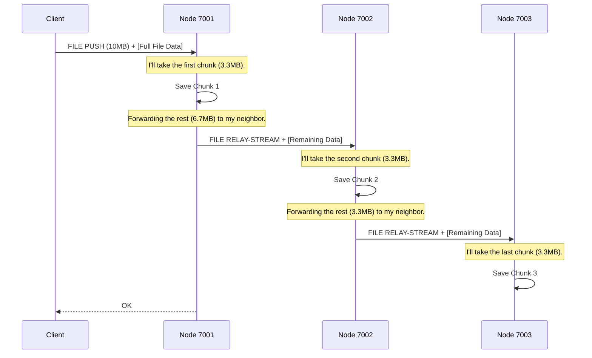

# Chapter 4: File Distribution & Chunking

In the [previous chapter](03_ring_topology___discovery_.md), we learned how OuroborosFS maps out its own network by passing a "sign-in sheet" around the ring. With this complete map, every [Node](02_node_.md) knows how many other nodes are in the network and how they are all connected.

Now, we can finally get to the core purpose of a file system: storing files! But in a distributed system, we can do this in a much smarter way than just dumping the whole file onto one computer.

## What Problem Does This Solve?

Imagine you have a very large file, like a high-resolution video. If you store this entire video on a single [Node](02_node_.md), you create two big problems:

1.  **Single Point of Failure:** If that one [Node](02_node_.md) goes offline, the entire video becomes unavailable.
2.  **Uneven Load:** That one [Node](02_node_.md) is doing all the work and using up all the storage space, while the others sit idle.

OuroborosFS solves this by splitting the file into smaller pieces and spreading them across the network.

**Our main use case: A user wants to upload a 10MB file called `vacation_video.mp4` to a three-node OuroborosFS ring. How does the system store this file without putting it all in one place?**

## The Book and Chapters Analogy

The strategy OuroborosFS uses is called **chunking**.

Instead of storing an entire file on one [Node](02_node_.md), we split it into smaller pieces called **chunks**. These chunks are then distributed sequentially around the ring, with each [Node](02_node_.md) storing one piece.

This is like splitting a large book into chapters and giving one chapter to each person at a round table.
*   **The Book:** The original file (`vacation_video.mp4`).
*   **The Chapters:** The chunks of the file.
*   **The People:** The Nodes in our ring.

This approach spreads the storage load and improves resilience. If one person leaves the table (a [Node](02_node_.md) goes down), we only lose one chapter, not the whole book. We'll see how we can recover from this in the next chapter on [Network Healing & Fault Tolerance](05_network_healing___fault_tolerance_.md).

## Storing a File: The `FILE PUSH` Command

Let's walk through how our `vacation_video.mp4` gets stored. The user will use a simple script to "push" the file to the network. This script connects to any [Node](02_node_.md) in the ring—let's call it Node A—and sends the `FILE PUSH` command.

**File:** `scripts/push_file.sh`
```bash
# Get the file size and name
SIZE_STR=$(wc --bytes < "${LOCAL_FILE}" | xargs)
FILE_NAME=$(basename "${LOCAL_FILE}")

# Send the command and the file data over the network
( printf "FILE PUSH ${SIZE_STR} ${FILE_NAME}\n"; cat "${LOCAL_FILE}" ) | nc ${HOST} ${PORT}
```
This script first creates a header like `FILE PUSH 10485760 vacation_video.mp4`, then immediately sends the raw file data after it. Now, let's see how the nodes handle this.

### A Diagram of the Distribution

Here's how the file data flows through our three-node ring (7001, 7002, 7003).


The file data is passed like a hot potato, with each [Node](02_node_.md) taking its portion before passing the rest along.

## Under the Hood: The Code for Chunking

Let's dive into the code that makes this elegant process work.

### 1. The First Hop: `handle_file_push`

When Node A receives the `FILE PUSH` command, its handler springs into action.

**File:** `src/server.rs`
```rust
async fn handle_file_push(/*...*/) -> Result<(), AnyErr> {
    // 1. Determine how many chunks to create.
    let parts: u32 = node.network_size().await as u32;

    // 2. Calculate the size of *my* chunk (the first one).
    let first_len = fair_chunk_len(0, size, parts);

    // 3. Read exactly that many bytes and save it.
    let mut first_chunk = vec![0u8; first_len as usize];
    reader.read_exact(&mut first_chunk).await?;
    save_into_node_dir(&node, &chunk_file_name(&name, 0, parts), &first_chunk, "content").await?;

    // 4. Forward the rest of the data to the next node.
    let mut s = TcpStream::connect(&next).await?;
    let header = format!("FILE RELAY-STREAM ...\n", /*...*/);
    s.write_all(header.as_bytes()).await?;
    copy(reader, &mut s).await?; // Stream remaining bytes

    // ... respond OK to the client ...
}
```
This handler is the starting point. It uses the `network_size` (which we learned about in the topology chapter) to decide that the file should be split into 3 `parts`. It then calls a helper, `fair_chunk_len`, to calculate the size for its chunk and saves it. Finally, it forwards the rest of the incoming data to its neighbor.

#### What is `fair_chunk_len`?

This helper function ensures the chunks are as evenly sized as possible. If a 10-byte file is split among 3 nodes, it can't be perfect. This function gives the first node 4 bytes, and the other two get 3 bytes each.

**File:** `src/server.rs`
```rust
fn fair_chunk_len(index: u32, total_size: u64, parts: u32) -> u64 {
    let base = total_size / parts as u64; // e.g., 10 / 3 = 3
    let rem = total_size % parts as u64;  // e.g., 10 % 3 = 1
    
    // The first `rem` chunks get one extra byte.
    if (index as u64) < rem { base + 1 } else { base }
}
```

### 2. Subsequent Hops: `handle_file_relay_stream`

When Node B receives the `FILE RELAY-STREAM` command, it executes a very similar logic.

**File:** `src/server.rs`
```rust
async fn handle_file_relay_stream(/*...*/) -> Result<(), AnyErr> {
    // 1. Calculate the size for *my* chunk (chunk number `index`).
    let my_len = fair_chunk_len(index, file_size, parts);
    
    // 2. Read exactly that many bytes and save it.
    let mut my_chunk = vec![0u8; my_len as usize];
    reader.read_exact(&mut my_chunk).await?;
    save_into_node_dir(/*...*/).await?;
    
    // 3. If there is still data left, forward it to the next node.
    let remaining = file_size - /* bytes consumed so far */;
    if remaining > 0 {
        // ... forward to next node with index + 1 ...
    }
    
    // ... respond OK to the previous node ...
}
```
This process repeats around the ring until the last [Node](02_node_.md) has taken its chunk and there is no data left to forward.

## Keeping Track: The `FileTag`

Storing the chunks is only half the story. The system also needs to remember how the file was split up so it can be reassembled later. For this, it creates a `FileTag`.

When Node A first receives the file, it creates a small record with three key pieces of information:

**File:** `src/node.rs`
```rust
pub struct FileTag {
    /// The port of the node where the first chunk is stored.
    pub start: u16,
    /// The total size of the original file.
    pub size: u64,
    /// The total number of chunks.
    pub parts: u32,
}
```
This `FileTag` is like a library card for the file. It tells any [Node](02_node_.md) everything it needs to know to find and reassemble `vacation_video.mp4`: "It starts at Node 7001, it's 10MB in total, and it's in 3 parts."

This tag is stored in the `file_tags` map on the first [Node](02_node_.md) and then shared with every other [Node](02_node_.md) in the ring, ensuring the entire system knows about the new file.

## Conclusion

You've just learned the core magic behind OuroborosFS's storage strategy!

*   Instead of storing whole files, OuroborosFS breaks them into smaller **chunks**.
*   The number of chunks is determined by the number of **known nodes in the ring**.
*   The chunks are **streamed sequentially** from one [Node](02_node_.md) to the next, with each [Node](02_node_.md) saving one piece.
*   A **`FileTag`** is created to serve as an index, recording where the file starts and how it was split.

This system is efficient and distributes the storage load perfectly. But what happens if a [Node](02_node_.md) holding a chunk suddenly crashes? How does the system handle that failure and prevent data loss?

In the next chapter, we'll explore the exciting mechanisms OuroborosFS uses to heal itself and tolerate faults.

➡️ **Next Chapter: [Network Healing & Fault Tolerance](05_network_healing___fault_tolerance_.md)**

---

Generated by [AI Codebase Knowledge Builder](https://github.com/The-Pocket/Tutorial-Codebase-Knowledge)