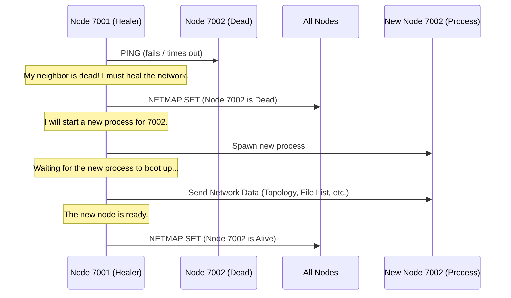

# Chapter 5: Network Healing & Fault Tolerance

In the [previous chapter](04_file_distribution___chunking_.md), we saw how OuroborosFS cleverly splits a large file into smaller **chunks** and distributes them across the [Nodes](02_node_.md) in the ring. This is great for balancing the load, but it introduces a critical question:

What happens if a [Node](02_node_.md) holding a precious chunk of our file suddenly crashes or goes offline?

This is where the system's immune system kicks in. OuroborosFS is designed to survive failures, automatically detect problems, and heal itself without any human intervention. This capability is called **fault tolerance**.

## The Buddy System Analogy

The core of OuroborosFS's fault tolerance is a simple but effective strategy: a "buddy system."

Imagine a team of night watchmen patrolling a circular path. Each watchman is responsible for making sure the watchman directly ahead of them is okay. Every few minutes, they'll call out, "Hey, Bob, you still there?" If Bob answers, everything is fine.

But if Bob doesn't answer after a few tries, the watchman assumes something is wrong. They immediately:
1.  **Raise the Alarm:** Informing the rest of the team that Bob's post is unmonitored.
2.  **Call for a Replacement:** Sending a request for a new watchman to take over Bob's post.
3.  **Brief the Newcomer:** Once the replacement arrives, they give them the map, the keys, and everything they need to do their job.
4.  **Give the All-Clear:** Announce that the post is covered again.

OuroborosFS [Nodes](02_node_.md) do exactly this. They constantly check on their neighbors, and if one disappears, they trigger a process to replace it and bring the network back to full strength.

### Our Use Case: Surviving a Crash

Let's make this real. Imagine you're looking at the OuroborosFS web interface, which shows a healthy, three-node ring.

**Our main use case: We will intentionally "kill" one of the running nodes. How does the system detect this failure and automatically bring a new, replacement node online to heal the ring?**

We'll see the node's status light turn red (dead) and then, a few moments later, turn black again (alive) as the system heals itself.

## Step 1: Detecting a Problem (The Gossip Protocol)

A [Node](02_node_.md) doesn't wait for something to go wrong. It's constantly checking on its neighbor using a simple "gossip" protocol. Every few seconds, it sends a `NODE PING` message and expects to get a `PONG` response back.

This check happens in a continuous loop that runs in the background for every [Node](02_node_.md).

**File:** `src/server.rs`
```rust
// The main gossip loop task
async fn spawn_gossip_loop(node: Arc<Node>) {
    loop {
        // Wait for the configured interval (e.g., 5 seconds)
        tokio::time::sleep(node.gossip_interval).await;

        // Find out who our neighbor is
        let Some(next_addr) = node.get_next().await else { continue; };

        // Check if they are healthy
        match check_node_health(node.clone(), &next_addr).await {
            Ok(_) => { /* All good! */ }
            Err(e) => {
                // Uh oh, they didn't respond. Start the healing process!
                handle_node_death(heal_node, next_addr).await;
            }
        }
    }
}
```
This loop is the heartbeat of the system's self-awareness. If the `check_node_health` function returns an error, it means the neighbor is unresponsive, and the healing process (`handle_node_death`) is triggered.

### How `check_node_health` Works

This function is very straightforward. It tries to connect to the neighbor, sends "PING", and waits for "PONG". If any of these steps fail or take too long, it returns an error.

**File:** `src/server.rs`
```rust
async fn check_node_health(_node: Arc<Node>, addr: &str) -> Result<(), AnyErr> {
    // We'll only wait 2 seconds for the whole conversation.
    let timeout = Duration::from_secs(2);

    // Connect, send, and read, all with a timeout.
    let mut stream = tokio::time::timeout(timeout, TcpStream::connect(addr)).await??;
    stream.write_all(b"NODE PING\n").await?;

    let mut reader = BufReader::new(stream);
    let mut buf = String::new();
    tokio::time::timeout(timeout, reader.read_line(&mut buf)).await??;

    if buf.trim() == "PONG" {
        Ok(()) // Success!
    } else {
        Err("invalid PONG response".into()) // They said something weird.
    }
}
```
This is the simple "Are you okay?" check. If it fails, the serious work begins.

## Step 2: The Healing Process

When a [Node](02_node_.md) detects its neighbor is dead, it takes on the responsibility of healing the network. This is a multi-step workflow orchestrated by the `handle_node_death` function.

### A Diagram of the Healing Flow

Let's say we have a ring of Node 7001, 7002, and 7003. Node 7001's gossip check for Node 7002 fails.



This process ensures that a dead [Node](02_node_.md) is not just replaced, but its replacement is fully integrated into the network with all the knowledge it needs.

## Under the Hood: The Healing Workflow in Code

Let's look at a simplified version of the `handle_node_death` function, broken down into its four key jobs.

**File:** `src/server.rs`

### 1. Announce the Failure

First, the healer [Node](02_node_.md) updates its own network map to mark the neighbor as "Dead". Then, it broadcasts this information to all other known nodes so that everyone in the ring agrees on the current network state.

```rust
async fn handle_node_death(node: Arc<Node>, dead_addr: String) -> Result<(), AnyErr> {
    // Job 1: Mark the node as Dead and tell everyone.
    let dead_port = port_str(&dead_addr).to_string();
    
    node.update_node_status(dead_port.clone(), "Dead").await;
    node.broadcast_netmap_update().await;
    
    // ... more steps to follow ...
```
This is important for transparency. A client asking for a file won't try to contact a [Node](02_node_.md) that the network knows is dead.

### 2. Relaunch the Fallen Node

Next, the healer [Node](02_node_.md) acts like an operator and starts a brand new OuroborosFS process to replace the one that died. It uses the exact same address and port as the old one.

```rust
    // ... continued from above ...

    // Job 2: Start a new process to replace the dead one.
    let exe = env::current_exe()?; // Find our own program path
    
    Command::new(exe)
        .arg("run")
        .arg("--addr")
        .arg(&dead_addr) // Relaunch on the same address
        .spawn()?; // Start the command and let it run independently
```
This is just like you typing `ouroborosfs run --addr 127.0.0.1:7002` in your terminal. The system is programmatically running itself.

### 3. Welcome the Newcomer

The newly spawned [Node](02_node_.md) is a blank slate. It knows nothing about the ring topology, the files stored in the system, or who its neighbor is. The healer [Node](02_node_.md) takes responsibility for bringing it up to speed.

```rust
    // ... continued from above ...

    // Job 3: Wait for the new node to start listening for connections.
    wait_until_listening(&dead_addr).await?;

    // Now, send it all the information it needs to join the ring.
    share_data_with_new_node(&node, &dead_addr).await?;
```
The `share_data_with_new_node` function connects to the new [Node](02_node_.md) and sends a series of `SET` commands (`TOPOLOGY SET`, `NETMAP SET`, `FILE TAGS-SET`) to populate its internal state.

### 4. Announce the Recovery

Finally, once the new [Node](02_node_.md) is fully configured and ready, the healer [Node](02_node_.md) marks it as "Alive" and broadcasts this final update to the entire network.

```rust
    // ... continued from above ...

    // Job 4: Mark the node as Alive and tell everyone.
    node.update_node_status(dead_port.clone(), "Alive").await;
    node.broadcast_netmap_update().await;

    tracing::info!("Healing process complete.");
    Ok(())
}
```
The ring is now whole again. A potential disaster has been automatically and cleanly resolved in a matter of seconds.

## Conclusion

You've just learned about OuroborosFS's powerful self-healing capabilities.

*   **Gossip Protocol:** [Nodes](02_node_.md) constantly check on their neighbors using a `PING`/`PONG` health check.
*   **Failure Detection:** If a neighbor fails to respond, it's considered "dead."
*   **Automated Healing:** The detecting [Node](02_node_.md) triggers a robust, four-step process to replace the dead [Node](02_node_.md).
    1.  Announce the death.
    2.  Respawn a new process.
    3.  Sync the new process with network data.
    4.  Announce the recovery.

This fault tolerance makes OuroborosFS a resilient system that can withstand unexpected failures.

Throughout these chapters, we've mentioned many commands like `NODE PING`, `TOPOLOGY WALK`, and `FILE PUSH`. In the final chapter, we'll take a closer look at the simple, line-based language that powers all communication in OuroborosFS.

➡️ **Next Chapter: [Command Protocol](06_command_protocol_.md)**

---

Generated by [AI Codebase Knowledge Builder](https://github.com/The-Pocket/Tutorial-Codebase-Knowledge)