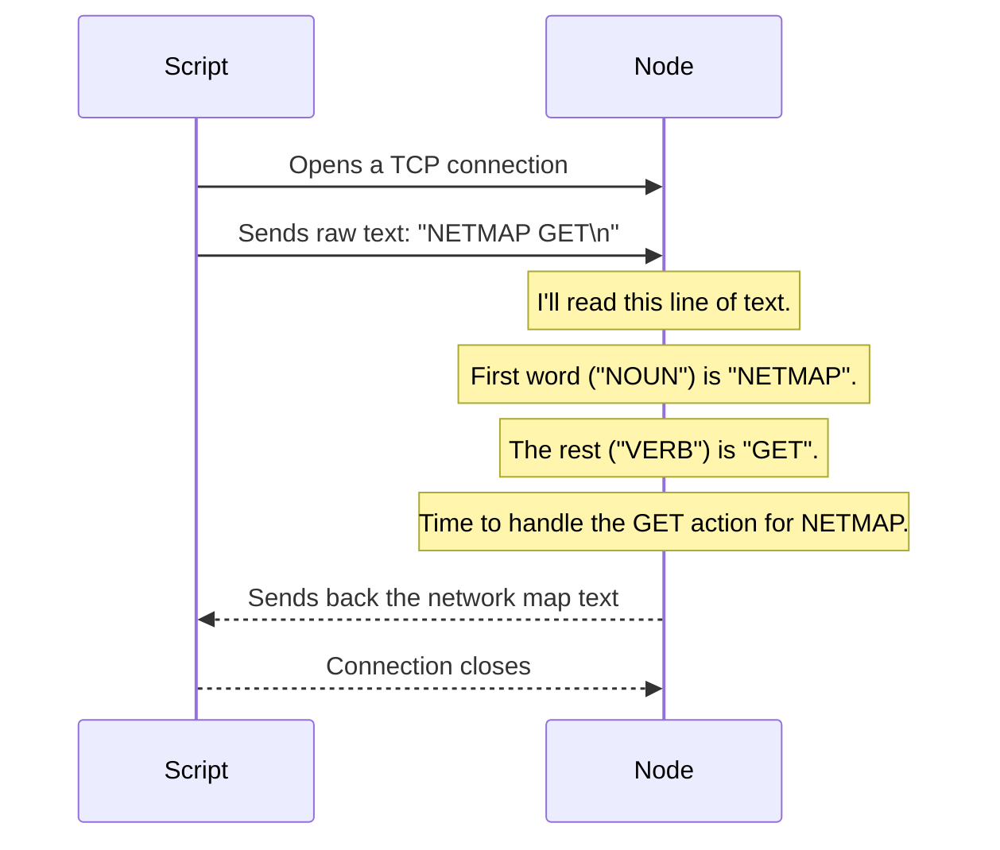

# Chapter 6: Command Protocol

In the [previous chapter](05_network_healing___fault_tolerance_.md), we saw how OuroborosFS can automatically detect a crashed [Node](02_node_.md) and heal the network. During that process, we mentioned commands like `NODE PING` and `NETMAP SET` being sent between nodes.

Throughout this entire tutorial, we've talked about commands like `TOPOLOGY WALK`, `FILE PUSH`, and `FILE LIST`. But how does this actually work? How can a script, a [Gateway](01_gateway_.md), or another [Node](02_node_.md) send an instruction that the receiver understands perfectly?

This is where the **Command Protocol** comes in. It's the simple, shared language of OuroborosFS.

## What Problem Does This Solve?

In any distributed system, the components need a standardized way to communicate. They need to agree on a set of rules for how to ask for things and how to respond. Without a shared language, it would be chaos.

The Command Protocol is that language. It's a simple, text-based set of rules that every part of OuroborosFS follows. It's like a secret handshake: if your message is formatted correctly, the [Node](02_node_.md) will understand and act. If not, it will be ignored or rejected.

**Our main use case: How can we use a simple command-line tool to ask a running node, "What is the current map of the network?"**

## The `<NOUN> <VERB>` Structure

The heart of the OuroborosFS protocol is a simple grammar: every command is structured as `<NOUN> <VERB>`, followed by any necessary parameters.

*   The **NOUN** groups related actions together. For example, anything related to files starts with `FILE`. Anything related to network topology starts with `TOPOLOGY`.
*   The **VERB** specifies the exact action you want to perform.

Let's look at some examples we've already seen:

*   `FILE PUSH <size> <name>`: The noun is `FILE`, the verb is `PUSH`.
*   `NODE PING`: The noun is `NODE`, the verb is `PING`.
*   `TOPOLOGY WALK`: The noun is `TOPOLOGY`, the verb is `WALK`.

This structure makes the protocol easy to read for humans and simple to parse for machines.

### Asking for the Network Map

To solve our use case, we need to ask a [Node](02_node_.md) for its view of the network. The command for this is `NETMAP GET`. Let's see how we can send this command from our terminal using a script.

**File:** `scripts/get_nodes.sh`
```bash
#!/usr/bin/env bash
HOST="127.0.0.1"
PORT="7000"

# Send the text "NETMAP GET" followed by a newline
# to the node at HOST:PORT
printf 'NETMAP GET\n' | nc ${HOST} ${PORT}
```
This script is incredibly simple:
1.  `printf 'NETMAP GET\n'` creates the exact text string for our command. The `\n` represents the "Enter" key, which signals the end of the line.
2.  The `|` (pipe) sends that text as input to the `nc` (netcat) command.
3.  `nc ${HOST} ${PORT}` is a basic networking utility that opens a connection to our [Node](02_node_.md) and sends the text it received.

When the [Node](02_node_.md) receives this message, it will respond with the current network map, which might look something like this:
```
7001=Alive
7002=Alive
7003=Alive
OK
```

## Under the Hood: Parsing the Command

What happens inside the [Node](02_node_.md) when it receives the raw text `NETMAP GET\n`? Let's follow the journey.



The [Node](02_node_.md) reads the incoming line of text and passes it to a central parser. This parser is responsible for turning the raw string into a structured command that the program can understand.

### A Glimpse into the Parser Code

The code for this is very logical and easy to follow.

**File:** `src/protocol.rs`
```rust
/// Parse one incoming line from the wire into a Command.
pub fn parse_line(line: &str) -> Result<Command, String> {
    // ... remove newline characters ...
    let mut parts = trimmed.splitn(2, ' ');
    let noun = parts.next().unwrap_or("").to_ascii_uppercase();
    let rest = parts.next().unwrap_or("");

    match noun.as_str() {
        "NODE" => parse_node_cmd(rest),
        "RING" => parse_ring_cmd(rest),
        "TOPOLOGY" => parse_topology_cmd(rest),
        "NETMAP" => parse_netmap_cmd(rest), // <-- This is our branch!
        "FILE" => parse_file_cmd(rest),
        _ => Err(/*...unknown command...*/),
    }
}
```
This main `parse_line` function does the first step: it splits the line into the `noun` (`"NETMAP"`) and the `rest` (`"GET"`). It then uses a `match` statement to call a more specific parser for that noun.

Let's look at the `parse_netmap_cmd` function:
**File:** `src/protocol.rs`
```rust
fn parse_netmap_cmd(rest: &str) -> Result<Command, String> {
    // ... other NETMAP verbs like HOP, DONE, SET ...

    if rest.eq_ignore_ascii_case("GET") {
        return Ok(Command::NetmapGet); // <-- Success!
    }

    Err("unknown NETMAP command".into())
}
```
This function checks the `rest` of the command string. Since it matches `"GET"`, it successfully creates a `Command::NetmapGet` object. The [Node](02_node_.md)'s main server loop then knows exactly what to do: call the function that retrieves the network map and sends it back to the client.

## What About Files? The Binary Data Rule

Most commands are simple, single lines of text. But what about `FILE PUSH`? We can't put the entire contents of a video file into a single line of text.

For this, the protocol has a special rule:
**If a command involves sending raw binary data, the text line acts as a header. This header *must* include the size of the data that will immediately follow it.**

Let's look at the `push_file.sh` script again.

**File:** `scripts/push_file.sh`
```bash
# ... code to get SIZE_STR and FILE_NAME ...

( printf "FILE PUSH ${SIZE_STR} ${FILE_NAME}\n"; cat "${LOCAL_FILE}" ) | nc ${HOST} ${PORT}
```
This is a clever shell command that does two things in sequence:
1.  `printf ...`: First, it sends the header line, e.g., `FILE PUSH 10485760 vacation_video.mp4\n`.
2.  `cat ...`: Immediately after, it sends the raw, binary contents of the local file.

When the receiving [Node](02_node_.md) parses the header, it sees the size `10485760`. It now knows it must read exactly that many bytes from the connection to get the complete file chunk. This is how the protocol handles both simple text commands and large data transfers cleanly.

## Conclusion

You've just learned about the **Command Protocol**, the fundamental language that powers all communication in OuroborosFS.

*   It's a simple, text-based protocol built on a **`<NOUN> <VERB>`** structure.
*   This shared language allows different components like the [Gateway](01_gateway_.md), [Nodes](02_node_.md), and scripts to **communicate reliably**.
*   Simple tools like `nc` (netcat) can be used to interact with the system directly from the command line.
*   For transferring data like files, the protocol uses a **header line** that specifies the size of the binary data to follow.

---

**A Final Word**

Congratulations on completing the OuroborosFS tutorial!

You've journeyed through the entire system, from the user-facing [Gateway](01_gateway_.md) to the inner workings of an individual [Node](02_node_.md). You've learned how nodes form a [Ring Topology & Discovery](03_ring_topology___discovery_.md), how they handle [File Distribution & Chunking](04_file_distribution___chunking_.md), and how they achieve [Network Healing & Fault Tolerance](05_network_healing___fault_tolerance_.md). Finally, you've seen the simple **Command Protocol** that ties it all together.

You now have a solid, high-level understanding of how a distributed file system can be built from simple, robust components. We encourage you to explore the source code further, try running the system yourself, and maybe even contribute to the project.

Happy coding

---

Generated by [AI Codebase Knowledge Builder](https://github.com/The-Pocket/Tutorial-Codebase-Knowledge)