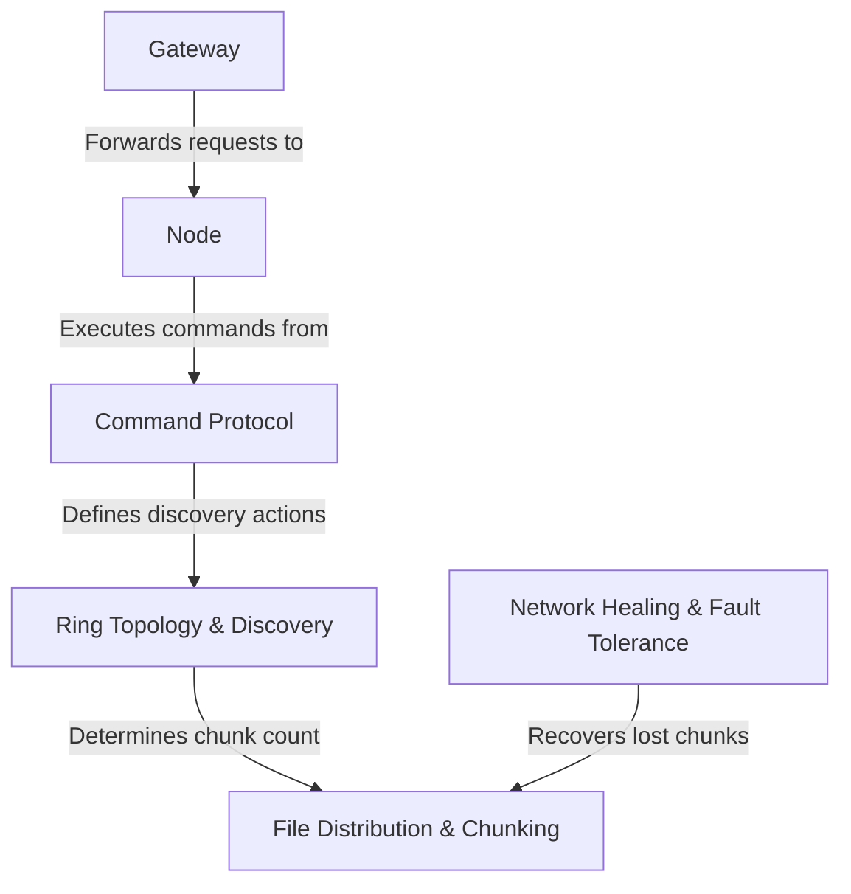

# Tutorial: OuroborosFS

OuroborosFS is a *distributed file system* that stores data across a network of computers. It organizes these computers,
called **Nodes**, into a self-healing *ring*. Instead of storing an entire file in one place, it splits it into smaller
**chunks** and distributes them around the ring, ensuring the system can survive and automatically recover from computer
failures.

**Source Repository:** [https://github.com/hazardous-sun/ouroboros-fs](https://github.com/hazardous-sun/ouroboros-fs)

## Chapters

1. [Gateway](01_gateway_.md)
2. [Node](02_node_.md)
3. [Ring Topology & Discovery](03_ring_topology___discovery_.md)
4. [File Distribution & Chunking](04_file_distribution___chunking_.md)
5. [Network Healing & Fault Tolerance](05_network_healing___fault_tolerance_.md)
6. [Command Protocol](06_command_protocol_.md)

---

Generated by [AI Codebase Knowledge Builder](https://github.com/The-Pocket/Tutorial-Codebase-Knowledge)